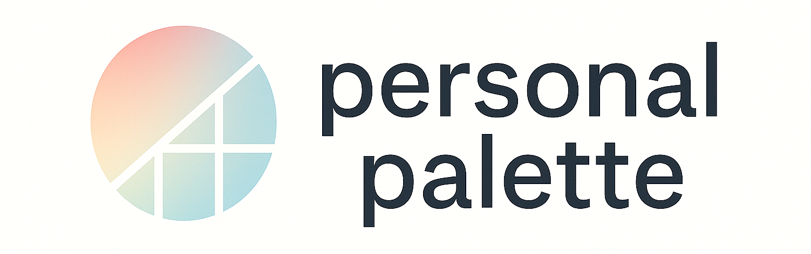

# Personal Palette



## 概要

> **あなたを形づくる、感性と成長の軌跡を描くパレット。**

**Personal Palette（パーソナルパレット）** は、  
自分の人生に影響を与えたコンテンツや、日々の学び・成長を一つの場所に記録し、  
“自分という作品”を可視化するための自己形成プラットフォームです。

---

## 🌈 コンセプト

人は、これまで出会ってきた「作品」や「経験」、  
そして「学び」によって形づくられています。  

Personal Paletteは、  
本・映画・音楽・体験・学習など、あなたの内面に色を与えてきたすべてを記録し、  
その軌跡を**ひとつのパレット**として見える形にします。

---

## ✨ 主な機能（MVP）

- 📝 **記録機能**：本・映画・学習・体験などを自由に登録  
- 🏷️ **タグ・カテゴリ管理**：「感性」「成長」などの観点で分類  
- 📖 **閲覧機能**：記録をタイムラインやパレットで一覧表示  
- 📊 **自己可視化**：自分を構成する要素をグラフィカルに俯瞰  

## ディレクトリ構成

本リポジトリのディレクトリ構造は以下の通りに構成する。

クリーンアーキテクチャに則ったレイヤー名、依存関係を取り入れる。

```yaml
project
├── adapter
├── app
├── cmd
├── domain               # ** ドメイン層 **
|    └── foo              # 任意のルートエンティティ
|       ├── entities     # エンティティ
|       ├── ids          # ID
|       ├── repositories # インターフェースリポジトリ
|       └── values       # 値オブジェクト
├── infra                # ** インフラストラクチャ層 **
   ├── database         # データベース
   ├── logger           # ロガー 
   ├── middlewares      # ミドルウェア
   ├── routers          # ルータ
   └── foo              # 任意のルートエンティティ
       ├── dtos         # gormモデルからドメインモデルへの変換
       ├── repositories # 実装リポジトリ
       └── seeders      # DBテストデータ

├── interfaces          # ** インターフェース層 **
   └── foo             # 任意のルートエンティティ
       └── controllers # コントローラ
     
└── usecase             # ** ユースケース層 **
    └── foo             # 任意のルートエンティティ
        ├── interactors # インターラクター
        ├── boundaries  # インプットバウンダリ 
        ├── requests    # リクエストモデル
        └── responses   # レスポンスモデル
```

## 環境構築

